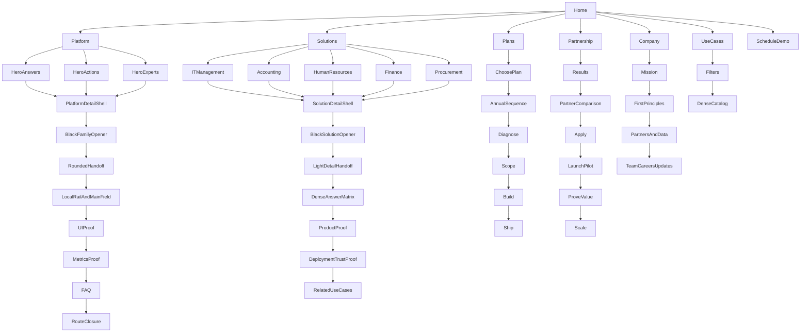

# Dayos — Recovered Route and Page-Mode Topology v0.1

**Tier:** Q3 — RECOVERED TOPOLOGY
**Status:** DERIVED / INK-VK RECOVERY
**Evidence basis:** rendered captures plus live-site route verification

Important: no literal user-supplied Mermaid syntax was detected in the current file set. This diagram is an Ink-VK-derived topology, not a recovered original Dayos diagram.

## Recovered page modes

- NARRATIVE MODE: Home and Company.
- FAMILY DETAIL MODE: Hero Answers, Hero Actions and Hero Experts.
- SOLUTION DENSE-PROOF MODE: IT Management and sibling solutions.
- LIBRARY MODE: Use Cases.
- DECISION + PROCESS MODE: Plans and Partnership.
- SINGLE-TASK MODE: Schedule Demo overlay.

The important recovered intelligence is not that every Dayos page uses the same template. It is the opposite: the shell is coherent while the information architecture changes according to the user's job.
